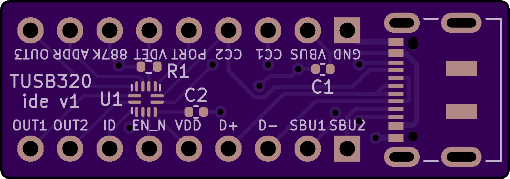

# TUSB320 Breakout Board

This PCB is a breakout board for the Texas Instruments TUSB320 chip and a USB-C connector (16+8 dummy pins).

## Features

- Headers for each pin of the TUSB320 chip and USB-C connector
- Built-in connections between the USB-C connector's CC1 and CC2 pins and the TUSB320 chip's respective CC1 and CC2 pins
- Pads for smoothing capacitors connected to voltage sources, namely VBUS and VDD. Smoothing capacitors are typically optional and you can leave them off (do not short to ground!) but filtering noise is a good practice.
- A pad for the 887K ohm resistor between the TUSB320 chip's VBUS_DET pin and the USB-C connector's VBUS pin. Note: VBUS_DET and VBUS are not connected by default.
- A jumper pad to connect VBUS_DET to VBUS with an 887K ohm resistor in between. You can either bridge the pads or use a 0 ohm resistor.

## Ordering

TBA

## BOM
| Reference | Part description                  | Size                                     | Example part #                                                                                                   |
|-----------|-----------------------------------|------------------------------------------|------------------------------------------------------------------------------------------------------------------|
| R1        | 887K ohm resistor                 | 0402                                     | [ERJ-2RKF8873X](https://www.digikey.com/en/products/detail/panasonic-electronic-components/ERJ-2RKF8873X/192503) |
| R2        | 0 ohm resistor (optional)         | 0402                                     | [ERJ-2GE0R00X](https://www.digikey.com/en/products/detail/panasonic-electronic-components/ERJ-2GE0R00X/146727)   |
| C1        | 1μF 35V capacitor                 | 0402                                     | [GRM155R6YA105KE11D](https://www.digikey.com/en/products/detail/murata-electronics/GRM155R6YA105KE11D/4905162)   |
| C2        | 0.1μF 5V capacitor                | 0402                                     | [04025C104KAT2A](https://www.digikey.com/en/products/detail/kyocera-avx/04025C104KAT2A/6564238)                  |
| J1        | USB-C connector (16+8 dummy pins) | Surface mount, right angle, through hole | [DX07S016JA1R1500](https://www.digikey.com/en/products/detail/jae-electronics/DX07S016JA1R1500/11585731)         |
| J2, J3    | 1x9 male through hole headers     |                                          | [PRPC009SAAN-RC](https://www.digikey.com/en/products/detail/sullins-connector-solutions/PRPC009SAAN-RC/2775245)  |
| U1        | TUSB320, TUSB320LI, TUSB320LAI    | 12-X2QFN                                 | [TUSB320LAIRWBR](https://www.digikey.com/en/products/detail/texas-instruments/TUSB320LAIRWBR/5722618)            |
